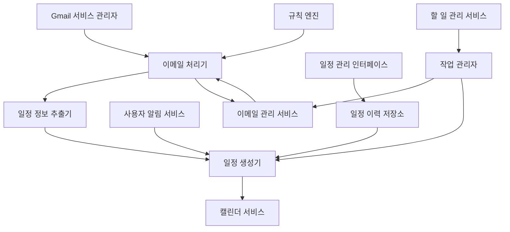

# 디자인 문서

## 개요

이 기능은 사용자가 Gmail에서 이메일을 보관 처리할 때 또는 사용자 요청 시, 해당 이메일의 내용을 분석하여 자동으로 관련 일정을 생성하는 시스템입니다. 또한 Gmail API를 활용하여 이메일 관리, 라벨링, 필터링 등 다양한 이메일 관련 작업을 수행할 수 있는 확장성을 제공합니다. 이를 통해 사용자는 이메일에 포함된 약속, 회의, 이벤트 등의 정보를 수동으로 캘린더에 입력하는 번거로움 없이 자동화된 일정 관리가 가능해지며, 다양한 이메일 관리 작업을 효율적으로 수행할 수 있습니다.

시스템은 Gmail API를 통해 보관 처리된 이메일과 읽지 않은 이메일을 감지하고, 자연어 처리를 통해 이메일 내용에서 일정 관련 정보를 추출한 후, 기존 캘린더 서비스를 활용하여 Google 캘린더에 일정을 생성합니다. 또한 사용자가 자동 생성된 일정을 확인하고 관리할 수 있는 인터페이스를 제공하며, 이메일 관리를 위한 다양한 기능을 제공합니다.

## 아키텍처

시스템은 다음과 같은 주요 컴포넌트로 구성됩니다:



1. **Gmail 서비스 관리자(Gmail Service Manager)**: Gmail API를 사용하여 보관 처리된 이메일과 읽지 않은 이메일을 감지하고 관리합니다.
2. **이메일 처리기(Email Processor)**: 이메일 내용을 가져와 처리합니다.
3. **일정 정보 추출기(Event Extractor)**: 자연어 처리를 통해 이메일에서 일정 관련 정보를 추출합니다.
4. **일정 생성기(Event Creator)**: 추출된 정보를 기반으로 캘린더 일정을 생성합니다.
5. **규칙 엔진(Rule Engine)**: 사용자가 정의한 규칙에 따라 이메일 처리 방식을 결정합니다.
6. **사용자 알림 서비스(Notification Service)**: 일정 생성 결과를 사용자에게 알립니다.
7. **일정 관리 인터페이스(Event Management Interface)**: 자동 생성된 일정을 관리하는 인터페이스를 제공합니다.
8. **일정 이력 저장소(Event History Repository)**: 자동 생성된 일정의 이력을 저장합니다.
9. **이메일 관리 서비스(Email Management Service)**: 이메일 라벨링, 보관, 삭제, 필터링 등의 관리 기능을 제공합니다.
10. **작업 관리자(Task Manager)**: 이메일과 캘린더 간의 통합 작업을 관리합니다.
11. **할 일 관리 서비스(Todo Management Service)**: 이메일 내용을 기반으로 할 일 항목을 생성하고 관리합니다.

## 컴포넌트 및 인터페이스

### 1. Gmail 서비스 관리자 (GmailServiceManager)

Gmail API를 사용하여 이메일을 감지하고 관리하는 컴포넌트입니다.

```python
class GmailServiceManager:
    """Gmail API를 사용하여 이메일을 감지하고 관리하는 클래스"""
    
    def __init__(self, auth_service, polling_interval=60):
        """
        Args:
            auth_service: Gmail API 인증 서비스
            polling_interval: 폴링 간격(초)
        """
        self.auth_service = auth_service
        self.polling_interval = polling_interval
        self._service = None
        self._last_check_time = None
    
    def start_watching(self):
        """이메일 감시 시작"""
        pass
    
    def stop_watching(self):
        """이메일 감시 중지"""
        pass
    
    def check_archived_emails(self):
        """보관 처리된 이메일 확인"""
        pass
    
    def check_unread_emails(self):
        """읽지 않은 이메일 확인"""
        pass
    
    def search_emails(self, query):
        """
        이메일 검색
        
        Args:
            query: 검색 쿼리
            
        Returns:
            검색 결과 이메일 목록
        """
        pass
    
    def apply_label(self, email_ids, label_name):
        """
        이메일에 라벨 적용
        
        Args:
            email_ids: 이메일 ID 목록
            label_name: 적용할 라벨 이름
            
        Returns:
            성공 여부
        """
        pass
    
    def archive_emails(self, email_ids):
        """
        이메일 보관 처리
        
        Args:
            email_ids: 이메일 ID 목록
            
        Returns:
            성공 여부
        """
        pass
    
    def delete_emails(self, email_ids):
        """
        이메일 삭제
        
        Args:
            email_ids: 이메일 ID 목록
            
        Returns:
            성공 여부
        """
        pass
    
    def create_filter(self, filter_criteria):
        """
        이메일 필터 생성
        
        Args:
            filter_criteria: 필터 조건
            
        Returns:
            생성된 필터 ID
        """
        pass
    
    def _get_service(self):
        """Gmail API 서비스 객체 가져오기"""
        pass
```

### 2. 이메일 처리기 (EmailProcessor)

이메일 내용을 가져와 처리하는 컴포넌트입니다.

```python
class EmailProcessor:
    """이메일 내용을 가져와 처리하는 클래스"""
    
    def __init__(self, gmail_service):
        """
        Args:
            gmail_service: Gmail API 서비스 객체
        """
        self.gmail_service = gmail_service
    
    def process_email(self, email_id):
        """
        이메일 처리
        
        Args:
            email_id: 처리할 이메일 ID
            
        Returns:
            처리된 이메일 내용
        """
        pass
    
    def process_emails(self, email_ids):
        """
        여러 이메일 일괄 처리
        
        Args:
            email_ids: 처리할 이메일 ID 목록
            
        Returns:
            처리된 이메일 내용 목록
        """
        pass
    
    def get_email_content(self, email_id):
        """
        이메일 내용 가져오기
        
        Args:
            email_id: 이메일 ID
            
        Returns:
            이메일 내용
        """
        pass
    
    def extract_email_metadata(self, email):
        """
        이메일 메타데이터 추출
        
        Args:
            email: 이메일 객체
            
        Returns:
            이메일 메타데이터
        """
        pass
    
    def extract_attachments(self, email):
        """
        이메일 첨부 파일 추출
        
        Args:
            email: 이메일 객체
            
        Returns:
            첨부 파일 목록
        """
        pass
    
    def mark_as_read(self, email_id):
        """
        이메일을 읽음으로 표시
        
        Args:
            email_id: 이메일 ID
            
        Returns:
            성공 여부
        """
        pass
    
    def reply_to_email(self, email_id, message):
        """
        이메일에 답장
        
        Args:
            email_id: 이메일 ID
            message: 답장 내용
            
        Returns:
            성공 여부
        """
        pass
```

### 3. 일정 정보 추출기 (EventExtractor)

자연어 처리를 통해 이메일에서 일정 관련 정보를 추출하는 컴포넌트입니다.

```python
class EventExtractor:
    """이메일에서 일정 관련 정보를 추출하는 클래스"""
    
    def __init__(self, nlp_service):
        """
        Args:
            nlp_service: 자연어 처리 서비스
        """
        self.nlp_service = nlp_service
    
    def extract_event_info(self, email_content):
        """
        이메일 내용에서 일정 정보 추출
        
        Args:
            email_content: 이메일 내용
            
        Returns:
            추출된 일정 정보
        """
        pass
    
    def extract_date_time(self, text):
        """
        텍스트에서 날짜/시간 정보 추출
        
        Args:
            text: 분석할 텍스트
            
        Returns:
            추출된 날짜/시간 정보
        """
        pass
    
    def extract_location(self, text):
        """
        텍스트에서 위치 정보 추출
        
        Args:
            text: 분석할 텍스트
            
        Returns:
            추출된 위치 정보
        """
        pass
    
    def extract_participants(self, text, email_metadata):
        """
        텍스트와 이메일 메타데이터에서 참석자 정보 추출
        
        Args:
            text: 분석할 텍스트
            email_metadata: 이메일 메타데이터
            
        Returns:
            추출된 참석자 정보
        """
        pass
    
    def calculate_confidence_score(self, extracted_info):
        """
        추출된 정보의 신뢰도 점수 계산
        
        Args:
            extracted_info: 추출된 정보
            
        Returns:
            신뢰도 점수
        """
        pass
```

### 4. 일정 생성기 (EventCreator)

추출된 정보를 기반으로 캘린더 일정을 생성하는 컴포넌트입니다.

```python
class EventCreator:
    """추출된 정보를 기반으로 캘린더 일정을 생성하는 클래스"""
    
    def __init__(self, calendar_service, event_history_repository, notification_service):
        """
        Args:
            calendar_service: 캘린더 서비스
            event_history_repository: 일정 이력 저장소
            notification_service: 알림 서비스
        """
        self.calendar_service = calendar_service
        self.event_history_repository = event_history_repository
        self.notification_service = notification_service
    
    def create_event(self, event_info, email_id, confidence_score):
        """
        일정 생성
        
        Args:
            event_info: 일정 정보
            email_id: 원본 이메일 ID
            confidence_score: 신뢰도 점수
            
        Returns:
            생성된 일정 정보
        """
        pass
    
    def request_user_confirmation(self, event_info, confidence_score):
        """
        사용자 확인 요청
        
        Args:
            event_info: 일정 정보
            confidence_score: 신뢰도 점수
            
        Returns:
            사용자 확인 결과
        """
        pass
    
    def format_event_data(self, event_info):
        """
        일정 정보 포맷팅
        
        Args:
            event_info: 일정 정보
            
        Returns:
            포맷팅된 일정 데이터
        """
        pass
```

### 5. 규칙 엔진 (RuleEngine)

사용자가 정의한 규칙에 따라 이메일 처리 방식을 결정하는 컴포넌트입니다.

```python
class EmailCalendarRuleEngine:
    """이메일 처리 규칙을 관리하는 클래스"""
    
    def __init__(self, rule_repository):
        """
        Args:
            rule_repository: 규칙 저장소
        """
        self.rule_repository = rule_repository
    
    def get_active_rules(self):
        """
        활성화된 규칙 목록 가져오기
        
        Returns:
            활성화된 규칙 목록
        """
        pass
    
    def add_rule(self, rule_data):
        """
        규칙 추가
        
        Args:
            rule_data: 규칙 데이터
            
        Returns:
            추가된 규칙 ID
        """
        pass
    
    def update_rule(self, rule_id, rule_data):
        """
        규칙 수정
        
        Args:
            rule_id: 규칙 ID
            rule_data: 규칙 데이터
            
        Returns:
            수정 성공 여부
        """
        pass
    
    def delete_rule(self, rule_id):
        """
        규칙 삭제
        
        Args:
            rule_id: 규칙 ID
            
        Returns:
            삭제 성공 여부
        """
        pass
    
    def toggle_rule_status(self, rule_id, active):
        """
        규칙 활성화/비활성화
        
        Args:
            rule_id: 규칙 ID
            active: 활성화 여부
            
        Returns:
            상태 변경 성공 여부
        """
        pass
```

### 6. 사용자 알림 서비스 (NotificationService)

일정 생성 결과를 사용자에게 알리는 컴포넌트입니다.

```python
class NotificationService:
    """사용자에게 알림을 보내는 클래스"""
    
    def __init__(self, email_service=None):
        """
        Args:
            email_service: 이메일 발송 서비스 (선택 사항)
        """
        self.email_service = email_service
    
    def notify_event_created(self, event_data, email_id):
        """
        일정 생성 알림
        
        Args:
            event_data: 생성된 일정 데이터
            email_id: 원본 이메일 ID
            
        Returns:
            알림 성공 여부
        """
        pass
    
    def request_confirmation(self, event_data, email_id):
        """
        확인 요청 알림
        
        Args:
            event_data: 일정 데이터
            email_id: 원본 이메일 ID
            
        Returns:
            요청 ID
        """
        pass
    
    def notify_error(self, error_message, email_id):
        """
        오류 알림
        
        Args:
            error_message: 오류 메시지
            email_id: 원본 이메일 ID
            
        Returns:
            알림 성공 여부
        """
        pass
```

### 7. 일정 이력 저장소 (EventHistoryRepository)

자동 생성된 일정의 이력을 저장하는 컴포넌트입니다.

```python
class EventHistoryRepository:
    """자동 생성된 일정의 이력을 저장하는 클래스"""
    
    def __init__(self, db_connection):
        """
        Args:
            db_connection: 데이터베이스 연결 객체
        """
        self.db_connection = db_connection
    
    def add_event_history(self, event_id, email_id, rule_id, confidence_score, event_data):
        """
        일정 이력 추가
        
        Args:
            event_id: 생성된 일정 ID
            email_id: 원본 이메일 ID
            rule_id: 적용된 규칙 ID
            confidence_score: 신뢰도 점수
            event_data: 일정 데이터
            
        Returns:
            추가된 이력 ID
        """
        pass
    
    def get_event_history(self, history_id):
        """
        일정 이력 조회
        
        Args:
            history_id: 이력 ID
            
        Returns:
            일정 이력 정보
        """
        pass
    
    def get_event_history_by_email(self, email_id):
        """
        이메일 ID로 일정 이력 조회
        
        Args:
            email_id: 이메일 ID
            
        Returns:
            일정 이력 정보 목록
        """
        pass
    
    def get_event_history_by_period(self, start_date, end_date):
        """
        기간으로 일정 이력 조회
        
        Args:
            start_date: 시작 날짜
            end_date: 종료 날짜
            
        Returns:
            일정 이력 정보 목록
        """
        pass
    
    def update_event_history_status(self, history_id, status):
        """
        일정 이력 상태 업데이트
        
        Args:
            history_id: 이력 ID
            status: 새 상태
            
        Returns:
            업데이트 성공 여부
        """
        pass
    
    def delete_event_history(self, history_id):
        """
        일정 이력 삭제
        
        Args:
            history_id: 이력 ID
            
        Returns:
            삭제 성공 여부
        """
        pass
```

### 8. Gmail 인증 서비스 (GmailAuthService)

Gmail API 인증을 처리하는 컴포넌트입니다.

```python
class GmailAuthService:
    """Gmail API 인증을 처리하는 클래스"""
    
    def __init__(
        self,
        scopes=None,
        token_path=None,
        credentials_path=None
    ):
        """
        Args:
            scopes: 요청할 권한 범위 목록
            token_path: 토큰 파일 경로
            credentials_path: 인증 정보 파일 경로
        """
        self.scopes = scopes or ["https://www.googleapis.com/auth/gmail.modify"]
        self.token_path = token_path
        self.credentials_path = credentials_path
        self._credentials = None
    
    def get_credentials(self, force_refresh=False):
        """
        Gmail API 인증 자격 증명 가져오기
        
        Args:
            force_refresh: 강제로 토큰을 갱신할지 여부
            
        Returns:
            유효한 Credentials 객체
        """
        pass
    
    def _start_auth_flow(self):
        """
        새로운 인증 플로우 시작
        
        Returns:
            새로운 Credentials 객체
        """
        pass
    
    def _save_token(self, creds):
        """
        자격 증명을 토큰 파일에 저장
        
        Args:
            creds: 저장할 Credentials 객체
        """
        pass
    
    def revoke_token(self):
        """
        현재 토큰을 취소하고 토큰 파일을 삭제
        
        Returns:
            성공 여부
        """
        pass
    
    def is_authenticated(self):
        """
        현재 인증 상태 확인
        
        Returns:
            인증 상태
        """
        pass
```

## 데이터 모델

### 1. 이메일 캘린더 규칙 (EmailCalendarRule)

```python
@dataclass
class EmailCalendarRule:
    """이메일 캘린더 자동화 규칙을 나타내는 데이터 클래스"""
    
    id: Optional[int] = None
    name: str = ""
    active: bool = True
    min_confidence_score: float = 0.7
    require_confirmation: bool = True
    created_at: Optional[datetime] = None
    updated_at: Optional[datetime] = None
```

### 2. 일정 이력 (EventHistory)

```python
@dataclass
class EventHistory:
    """자동 생성된 일정의 이력을 나타내는 데이터 클래스"""
    
    id: Optional[int] = None
    event_id: str = ""
    email_id: str = ""
    rule_id: Optional[int] = None
    confidence_score: float = 0.0
    status: str = "created"  # created, confirmed, modified, deleted
    event_data: dict = field(default_factory=dict)
    created_at: Optional[datetime] = None
    updated_at: Optional[datetime] = None
```

### 3. 이메일 메타데이터 (EmailMetadata)

```python
@dataclass
class EmailMetadata:
    """이메일 메타데이터를 나타내는 데이터 클래스"""
    
    id: str = ""
    thread_id: str = ""
    subject: str = ""
    sender: str = ""
    recipients: List[str] = field(default_factory=list)
    cc: List[str] = field(default_factory=list)
    date: Optional[datetime] = None
    labels: List[str] = field(default_factory=list)
```

### 4. 추출된 일정 정보 (ExtractedEventInfo)

```python
@dataclass
class ExtractedEventInfo:
    """이메일에서 추출된 일정 정보를 나타내는 데이터 클래스"""
    
    summary: str = ""
    start_time: Optional[datetime] = None
    end_time: Optional[datetime] = None
    location: Optional[str] = None
    description: Optional[str] = None
    participants: List[str] = field(default_factory=list)
    all_day: bool = False
    confidence_scores: Dict[str, float] = field(default_factory=dict)
    overall_confidence: float = 0.0
```

## 데이터베이스 스키마

### 1. email_calendar_rules 테이블

```sql
CREATE TABLE IF NOT EXISTS email_calendar_rules (
    id INTEGER PRIMARY KEY AUTOINCREMENT,
    name TEXT NOT NULL,
    active BOOLEAN NOT NULL DEFAULT 1,
    min_confidence_score REAL NOT NULL DEFAULT 0.7,
    require_confirmation BOOLEAN NOT NULL DEFAULT 1,
    created_at TIMESTAMP NOT NULL DEFAULT CURRENT_TIMESTAMP,
    updated_at TIMESTAMP NOT NULL DEFAULT CURRENT_TIMESTAMP
);
```

### 2. event_history 테이블

```sql
CREATE TABLE IF NOT EXISTS event_history (
    id INTEGER PRIMARY KEY AUTOINCREMENT,
    event_id TEXT NOT NULL,
    email_id TEXT NOT NULL,
    rule_id INTEGER,
    confidence_score REAL NOT NULL,
    status TEXT NOT NULL DEFAULT 'created',
    event_data TEXT NOT NULL,  -- JSON 형식으로 저장
    created_at TIMESTAMP NOT NULL DEFAULT CURRENT_TIMESTAMP,
    updated_at TIMESTAMP NOT NULL DEFAULT CURRENT_TIMESTAMP,
    FOREIGN KEY (rule_id) REFERENCES email_calendar_rules (id) ON DELETE SET NULL
);
```

## 오류 처리

시스템은 다음과 같은 예외 클래스를 통해 오류를 처리합니다:

```python
class EmailCalendarError(Exception):
    """이메일 캘린더 자동화 관련 기본 예외 클래스"""
    pass

class GmailApiError(EmailCalendarError):
    """Gmail API 관련 오류"""
    pass

class EmailProcessingError(EmailCalendarError):
    """이메일 처리 중 발생한 오류"""
    pass

class EventExtractionError(EmailCalendarError):
    """일정 정보 추출 중 발생한 오류"""
    pass

class EventCreationError(EmailCalendarError):
    """일정 생성 중 발생한 오류"""
    pass

class RuleEngineError(EmailCalendarError):
    """규칙 엔진 관련 오류"""
    pass

class NotificationError(EmailCalendarError):
    """알림 관련 오류"""
    pass

class RepositoryError(EmailCalendarError):
    """저장소 관련 오류"""
    pass

class AuthenticationError(EmailCalendarError):
    """인증 관련 오류"""
    pass
```

## 테스트 전략

시스템의 테스트는 다음과 같은 전략으로 수행됩니다:

1. **단위 테스트**: 각 컴포넌트의 개별 기능을 테스트합니다.
   - Gmail 감시자의 이메일 감지 기능
   - 이메일 처리기의 내용 추출 기능
   - 일정 정보 추출기의 정보 추출 기능
   - 일정 생성기의 일정 생성 기능
   - 규칙 엔진의 규칙 적용 기능
   - 알림 서비스의 알림 발송 기능
   - 이력 저장소의 CRUD 기능

2. **통합 테스트**: 여러 컴포넌트 간의 상호작용을 테스트합니다.
   - 이메일 감지부터 일정 생성까지의 전체 흐름
   - Gmail API와의 통합
   - 캘린더 서비스와의 통합
   - 데이터베이스와의 통합

3. **모의 테스트**: 외부 의존성을 모의(mock) 객체로 대체하여 테스트합니다.
   - Gmail API 모의 객체
   - 캘린더 서비스 모의 객체
   - 자연어 처리 서비스 모의 객체

4. **시나리오 테스트**: 실제 사용 시나리오를 기반으로 테스트합니다.
   - 회의 초대 이메일 처리
   - 약속 확인 이메일 처리
   - 이벤트 안내 이메일 처리
   - 한국어 이메일 처리

## 구현 고려사항

1. **Gmail API 제한**: Gmail API의 할당량 및 속도 제한을 고려하여 폴링 간격을 적절히 설정해야 합니다.

2. **자연어 처리**: 한국어 이메일에서 일정 정보를 정확히 추출하기 위해 적절한 자연어 처리 기술을 선택해야 합니다. Google Generative AI(Gemini)를 활용하여 이메일에서 구조화된 일정 정보를 추출할 수 있습니다.

3. **사용자 경험**: 사용자가 자동 생성된 일정을 쉽게 확인하고 관리할 수 있는 인터페이스를 제공해야 합니다.

4. **보안**: Gmail 및 캘린더 데이터에 접근하기 위한 인증 정보를 안전하게 관리해야 합니다.

5. **오류 복구**: 시스템 오류 발생 시 자동으로 복구할 수 있는 메커니즘을 구현해야 합니다.

6. **성능 최적화**: 이메일 처리 및 일정 생성 과정을 최적화하여 시스템 부하를 최소화해야 합니다.

7. **확장성**: 향후 다른 이메일 제공자나 캘린더 서비스를 지원할 수 있도록 확장 가능한 구조로 설계해야 합니다.### 9. 
이메일 관리 서비스 (EmailManagementService)

이메일 라벨링, 보관, 삭제, 필터링 등의 관리 기능을 제공하는 컴포넌트입니다.

```python
class EmailManagementService:
    """이메일 관리 기능을 제공하는 클래스"""
    
    def __init__(self, gmail_service_manager):
        """
        Args:
            gmail_service_manager: Gmail 서비스 관리자
        """
        self.gmail_service_manager = gmail_service_manager
    
    def create_label(self, label_name, label_color=None):
        """
        라벨 생성
        
        Args:
            label_name: 라벨 이름
            label_color: 라벨 색상 (선택 사항)
            
        Returns:
            생성된 라벨 ID
        """
        pass
    
    def get_labels(self):
        """
        라벨 목록 가져오기
        
        Returns:
            라벨 목록
        """
        pass
    
    def apply_label_to_emails(self, email_ids, label_name):
        """
        이메일에 라벨 적용
        
        Args:
            email_ids: 이메일 ID 목록
            label_name: 적용할 라벨 이름
            
        Returns:
            성공 여부
        """
        pass
    
    def remove_label_from_emails(self, email_ids, label_name):
        """
        이메일에서 라벨 제거
        
        Args:
            email_ids: 이메일 ID 목록
            label_name: 제거할 라벨 이름
            
        Returns:
            성공 여부
        """
        pass
    
    def archive_emails(self, email_ids):
        """
        이메일 보관 처리
        
        Args:
            email_ids: 이메일 ID 목록
            
        Returns:
            성공 여부
        """
        pass
    
    def delete_emails(self, email_ids):
        """
        이메일 삭제
        
        Args:
            email_ids: 이메일 ID 목록
            
        Returns:
            성공 여부
        """
        pass
    
    def create_filter(self, filter_criteria, actions):
        """
        이메일 필터 생성
        
        Args:
            filter_criteria: 필터 조건
            actions: 필터 적용 시 수행할 작업
            
        Returns:
            생성된 필터 ID
        """
        pass
    
    def get_filters(self):
        """
        필터 목록 가져오기
        
        Returns:
            필터 목록
        """
        pass
    
    def update_filter(self, filter_id, filter_criteria=None, actions=None):
        """
        필터 수정
        
        Args:
            filter_id: 필터 ID
            filter_criteria: 필터 조건 (선택 사항)
            actions: 필터 적용 시 수행할 작업 (선택 사항)
            
        Returns:
            성공 여부
        """
        pass
    
    def delete_filter(self, filter_id):
        """
        필터 삭제
        
        Args:
            filter_id: 필터 ID
            
        Returns:
            성공 여부
        """
        pass
    
    def search_emails(self, query, max_results=100):
        """
        이메일 검색
        
        Args:
            query: 검색 쿼리
            max_results: 최대 결과 수 (선택 사항)
            
        Returns:
            검색 결과 이메일 목록
        """
        pass
```

### 10. 작업 관리자 (TaskManager)

이메일과 캘린더 간의 통합 작업을 관리하는 컴포넌트입니다.

```python
class TaskManager:
    """이메일과 캘린더 간의 통합 작업을 관리하는 클래스"""
    
    def __init__(self, email_processor, event_creator, todo_service):
        """
        Args:
            email_processor: 이메일 처리기
            event_creator: 일정 생성기
            todo_service: 할 일 관리 서비스
        """
        self.email_processor = email_processor
        self.event_creator = event_creator
        self.todo_service = todo_service
    
    def create_follow_up_reminder(self, email_id, reminder_date):
        """
        이메일에 대한 후속 조치 리마인더 생성
        
        Args:
            email_id: 이메일 ID
            reminder_date: 리마인더 날짜
            
        Returns:
            생성된 리마인더 ID
        """
        pass
    
    def create_task_from_email(self, email_id, task_details=None):
        """
        이메일 내용을 기반으로 할 일 항목 생성
        
        Args:
            email_id: 이메일 ID
            task_details: 추가 할 일 세부 정보 (선택 사항)
            
        Returns:
            생성된 할 일 항목 ID
        """
        pass
    
    def link_emails_to_event(self, event_id, email_ids):
        """
        캘린더 일정에 이메일 연결
        
        Args:
            event_id: 일정 ID
            email_ids: 연결할 이메일 ID 목록
            
        Returns:
            성공 여부
        """
        pass
    
    def send_event_notification_email(self, event_id, recipients, message=None):
        """
        일정 관련 알림 이메일 발송
        
        Args:
            event_id: 일정 ID
            recipients: 수신자 목록
            message: 추가 메시지 (선택 사항)
            
        Returns:
            성공 여부
        """
        pass
    
    def notify_event_changes(self, event_id, email_thread_id, changes):
        """
        일정 변경 사항을 이메일 스레드에 알림
        
        Args:
            event_id: 일정 ID
            email_thread_id: 이메일 스레드 ID
            changes: 변경 사항
            
        Returns:
            성공 여부
        """
        pass
```

### 11. 할 일 관리 서비스 (TodoManagementService)

이메일 내용을 기반으로 할 일 항목을 생성하고 관리하는 컴포넌트입니다.

```python
class TodoManagementService:
    """할 일 항목을 생성하고 관리하는 클래스"""
    
    def __init__(self, todo_repository):
        """
        Args:
            todo_repository: 할 일 저장소
        """
        self.todo_repository = todo_repository
    
    def create_task(self, task_data):
        """
        할 일 항목 생성
        
        Args:
            task_data: 할 일 데이터
            
        Returns:
            생성된 할 일 항목 ID
        """
        pass
    
    def get_task(self, task_id):
        """
        할 일 항목 조회
        
        Args:
            task_id: 할 일 항목 ID
            
        Returns:
            할 일 항목 정보
        """
        pass
    
    def update_task(self, task_id, task_data):
        """
        할 일 항목 수정
        
        Args:
            task_id: 할 일 항목 ID
            task_data: 수정할 할 일 데이터
            
        Returns:
            성공 여부
        """
        pass
    
    def delete_task(self, task_id):
        """
        할 일 항목 삭제
        
        Args:
            task_id: 할 일 항목 ID
            
        Returns:
            성공 여부
        """
        pass
    
    def get_tasks_by_email(self, email_id):
        """
        이메일 ID로 할 일 항목 조회
        
        Args:
            email_id: 이메일 ID
            
        Returns:
            할 일 항목 목록
        """
        pass
    
    def mark_task_completed(self, task_id):
        """
        할 일 항목을 완료로 표시
        
        Args:
            task_id: 할 일 항목 ID
            
        Returns:
            성공 여부
        """
        pass
    
    def get_tasks_by_due_date(self, start_date, end_date):
        """
        기한별 할 일 항목 조회
        
        Args:
            start_date: 시작 날짜
            end_date: 종료 날짜
            
        Returns:
            할 일 항목 목록
        """
        pass
```###
 5. 이메일 필터 (EmailFilter)

```python
@dataclass
class EmailFilter:
    """이메일 필터를 나타내는 데이터 클래스"""
    
    id: Optional[str] = None
    criteria: Dict[str, str] = field(default_factory=dict)
    actions: Dict[str, Any] = field(default_factory=dict)
    created_at: Optional[datetime] = None
```

### 6. 할 일 항목 (TodoItem)

```python
@dataclass
class TodoItem:
    """할 일 항목을 나타내는 데이터 클래스"""
    
    id: Optional[int] = None
    title: str = ""
    description: Optional[str] = None
    due_date: Optional[datetime] = None
    priority: int = 0  # 0: 낮음, 1: 보통, 2: 높음
    status: str = "pending"  # pending, completed, canceled
    email_id: Optional[str] = None
    event_id: Optional[str] = None
    created_at: Optional[datetime] = None
    updated_at: Optional[datetime] = None
```### 3. em
ail_filters 테이블

```sql
CREATE TABLE IF NOT EXISTS email_filters (
    id INTEGER PRIMARY KEY AUTOINCREMENT,
    filter_id TEXT NOT NULL,
    criteria TEXT NOT NULL,  -- JSON 형식으로 저장
    actions TEXT NOT NULL,   -- JSON 형식으로 저장
    created_at TIMESTAMP NOT NULL DEFAULT CURRENT_TIMESTAMP
);
```

### 4. todo_items 테이블

```sql
CREATE TABLE IF NOT EXISTS todo_items (
    id INTEGER PRIMARY KEY AUTOINCREMENT,
    title TEXT NOT NULL,
    description TEXT,
    due_date TIMESTAMP,
    priority INTEGER NOT NULL DEFAULT 0,
    status TEXT NOT NULL DEFAULT 'pending',
    email_id TEXT,
    event_id TEXT,
    created_at TIMESTAMP NOT NULL DEFAULT CURRENT_TIMESTAMP,
    updated_at TIMESTAMP NOT NULL DEFAULT CURRENT_TIMESTAMP
);
```

### 5. email_event_links 테이블

```sql
CREATE TABLE IF NOT EXISTS email_event_links (
    id INTEGER PRIMARY KEY AUTOINCREMENT,
    email_id TEXT NOT NULL,
    event_id TEXT NOT NULL,
    link_type TEXT NOT NULL DEFAULT 'reference',  -- reference, source, notification
    created_at TIMESTAMP NOT NULL DEFAULT CURRENT_TIMESTAMP,
    UNIQUE(email_id, event_id)
);
```