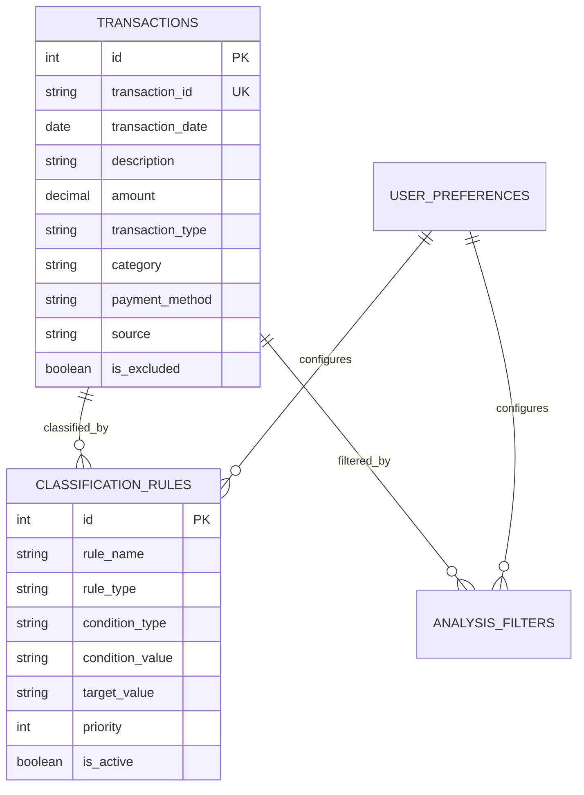

# 개인 금융 거래 관리 시스템 설계

## 개요

개인 금융 거래 관리 시스템은 다양한 데이터 소스로부터 거래 내역을 수집하고, 지능형 분류 및 분석 기능을 제공하는 Python 기반 시스템입니다. SQLite 데이터베이스를 사용하여 로컬에서 안전하게 데이터를 관리하며, 사용자의 거래 패턴을 학습하여 점점 더 정확한 분류를 제공합니다.

## 아키텍처

### 전체 시스템 아키텍처

```
┌─────────────────────────────────────────────────────────────┐
│                    사용자 인터페이스 계층                      │
├─────────────────────────────────────────────────────────────┤
│  CLI Interface  │  분석 도구  │  수동 입력 도구  │  설정 관리   │
└─────────────────────────────────────────────────────────────┘
                                │
┌─────────────────────────────────────────────────────────────┐
│                      서비스 계층                             │
├─────────────────────────────────────────────────────────────┤
│  거래 수집 서비스  │  분류 서비스  │  분석 서비스  │  규칙 엔진   │
└─────────────────────────────────────────────────────────────┘
                                │
┌─────────────────────────────────────────────────────────────┐
│                      데이터 계층                             │
├─────────────────────────────────────────────────────────────┤
│     SQLite DB     │  파일 시스템  │  설정 저장소  │  백업 시스템  │
└─────────────────────────────────────────────────────────────┘
                                │
┌─────────────────────────────────────────────────────────────┐
│                    외부 데이터 소스                           │
├─────────────────────────────────────────────────────────────┤
│  토스뱅크 카드 XLSX │ 토스뱅크 계좌 CSV │ 수동 입력 │ 기타 은행   │
└─────────────────────────────────────────────────────────────┘
```

### 핵심 컴포넌트

#### 1. 데이터 수집 엔진 (Data Ingestion Engine)
- **역할**: 다양한 소스로부터 거래 데이터 수집 및 정규화
- **구성요소**:
  - `BaseIngester`: 추상 기본 클래스
  - `TossBankCardIngester`: 토스뱅크 카드 XLSX 처리
  - `TossBankAccountIngester`: 토스뱅크 계좌 CSV 처리
  - `ManualIngester`: 수동 입력 처리
  - `IngesterFactory`: 수집기 팩토리

#### 2. 지능형 분류 엔진 (Smart Classification Engine)
- **역할**: 거래 내역 자동 분류 및 학습
- **구성요소**:
  - `CategoryClassifier`: 카테고리 분류기
  - `PaymentMethodClassifier`: 결제 방식 분류기
  - `RuleEngine`: 사용자 정의 규칙 처리
  - `LearningEngine`: 패턴 학습 및 개선
  - `FilterEngine`: 거래 필터링

#### 3. 분석 엔진 (Analytics Engine)
- **역할**: 다양한 관점의 거래 분석 및 리포팅
- **구성요소**:
  - `ExpenseAnalyzer`: 지출 분석
  - `IncomeAnalyzer`: 수입 분석
  - `TrendAnalyzer`: 트렌드 분석
  - `ComparisonAnalyzer`: 비교 분석
  - `ReportGenerator`: 리포트 생성

#### 4. 데이터 관리 계층 (Data Management Layer)
- **역할**: 데이터 저장, 조회, 백업 관리
- **구성요소**:
  - `TransactionRepository`: 거래 데이터 저장소
  - `RuleRepository`: 분류 규칙 저장소
  - `ConfigRepository`: 설정 저장소
  - `BackupManager`: 백업 관리자

## 데이터 모델

### 핵심 엔티티

#### Transaction (거래)
```sql
CREATE TABLE transactions (
    id INTEGER PRIMARY KEY,
    transaction_id TEXT UNIQUE,           -- 고유 거래 ID
    transaction_date DATE NOT NULL,       -- 거래 날짜
    description TEXT NOT NULL,            -- 거래 설명
    amount DECIMAL(12,2) NOT NULL,        -- 거래 금액
    transaction_type TEXT NOT NULL,       -- 거래 유형 (expense/income)
    category TEXT,                        -- 카테고리
    payment_method TEXT,                  -- 결제 방식
    source TEXT NOT NULL,                 -- 데이터 소스
    account_type TEXT,                    -- 계좌 유형
    memo TEXT,                           -- 메모
    is_excluded BOOLEAN DEFAULT FALSE,    -- 분석 제외 여부
    created_at TIMESTAMP DEFAULT CURRENT_TIMESTAMP,
    updated_at TIMESTAMP DEFAULT CURRENT_TIMESTAMP
);
```

#### Classification Rules (분류 규칙)
```sql
CREATE TABLE classification_rules (
    id INTEGER PRIMARY KEY,
    rule_name TEXT NOT NULL,
    rule_type TEXT NOT NULL,              -- category/payment_method/filter
    condition_type TEXT NOT NULL,         -- contains/equals/regex/amount_range
    condition_value TEXT NOT NULL,        -- 조건 값
    target_value TEXT NOT NULL,           -- 분류 결과 값
    priority INTEGER DEFAULT 0,           -- 우선순위
    is_active BOOLEAN DEFAULT TRUE,       -- 활성화 여부
    created_by TEXT DEFAULT 'user',       -- 생성자 (user/system/learned)
    created_at TIMESTAMP DEFAULT CURRENT_TIMESTAMP
);
```

#### User Preferences (사용자 설정)
```sql
CREATE TABLE user_preferences (
    id INTEGER PRIMARY KEY,
    preference_key TEXT UNIQUE NOT NULL,
    preference_value TEXT NOT NULL,
    description TEXT,
    updated_at TIMESTAMP DEFAULT CURRENT_TIMESTAMP
);
```

#### Analysis Filters (분석 필터)
```sql
CREATE TABLE analysis_filters (
    id INTEGER PRIMARY KEY,
    filter_name TEXT NOT NULL,
    filter_config JSON NOT NULL,          -- 필터 설정 (JSON)
    is_default BOOLEAN DEFAULT FALSE,     -- 기본 필터 여부
    created_at TIMESTAMP DEFAULT CURRENT_TIMESTAMP
);
```

### 데이터 관계



## 컴포넌트 및 인터페이스

### 1. 데이터 수집 컴포넌트

#### BaseIngester (추상 클래스)
```python
from abc import ABC, abstractmethod
from typing import List, Dict, Any

class BaseIngester(ABC):
    @abstractmethod
    def validate_file(self, file_path: str) -> bool:
        """파일 유효성 검증"""
        pass
    
    @abstractmethod
    def extract_transactions(self, file_path: str) -> List[Dict[str, Any]]:
        """거래 데이터 추출"""
        pass
    
    @abstractmethod
    def normalize_data(self, raw_data: List[Dict[str, Any]]) -> List[Dict[str, Any]]:
        """데이터 정규화"""
        pass
```

#### TossBankCardIngester
```python
class TossBankCardIngester(BaseIngester):
    def __init__(self, classifier: CategoryClassifier):
        self.classifier = classifier
    
    def validate_file(self, file_path: str) -> bool:
        # XLSX 파일 구조 검증
        pass
    
    def extract_transactions(self, file_path: str) -> List[Dict[str, Any]]:
        # 카드 이용내역 추출 및 취소 거래 처리
        pass
    
    def normalize_data(self, raw_data: List[Dict[str, Any]]) -> List[Dict[str, Any]]:
        # 표준 거래 형식으로 변환
        pass
```

### 2. 분류 컴포넌트

#### CategoryClassifier
```python
class CategoryClassifier:
    def __init__(self, rule_engine: RuleEngine, learning_engine: LearningEngine):
        self.rule_engine = rule_engine
        self.learning_engine = learning_engine
    
    def classify(self, transaction: Dict[str, Any]) -> str:
        """거래를 카테고리로 분류"""
        # 1. 사용자 정의 규칙 적용
        # 2. 학습된 패턴 적용
        # 3. 기본 규칙 적용
        pass
    
    def learn_from_correction(self, transaction: Dict[str, Any], correct_category: str):
        """사용자 수정사항으로부터 학습"""
        pass
```

#### RuleEngine
```python
class RuleEngine:
    def __init__(self, rule_repository: RuleRepository):
        self.rule_repository = rule_repository
    
    def apply_rules(self, transaction: Dict[str, Any], rule_type: str) -> str:
        """규칙 적용하여 분류"""
        pass
    
    def add_rule(self, rule: ClassificationRule):
        """새 규칙 추가"""
        pass
    
    def update_rule_priority(self, rule_id: int, priority: int):
        """규칙 우선순위 업데이트"""
        pass
```

### 3. 분석 컴포넌트

#### ExpenseAnalyzer
```python
class ExpenseAnalyzer:
    def __init__(self, transaction_repository: TransactionRepository):
        self.repository = transaction_repository
    
    def analyze_by_period(self, start_date: date, end_date: date, 
                         filters: AnalysisFilter = None) -> ExpenseReport:
        """기간별 지출 분석"""
        pass
    
    def analyze_by_category(self, start_date: date, end_date: date,
                           filters: AnalysisFilter = None) -> CategoryReport:
        """카테고리별 지출 분석"""
        pass
    
    def analyze_trends(self, months: int = 6) -> TrendReport:
        """지출 트렌드 분석"""
        pass
```

#### FilterEngine
```python
class FilterEngine:
    def apply_filters(self, transactions: List[Transaction], 
                     filters: AnalysisFilter) -> List[Transaction]:
        """필터 조건 적용"""
        pass
    
    def create_filter(self, conditions: Dict[str, Any]) -> AnalysisFilter:
        """필터 생성"""
        pass
```

## 에러 처리

### 예외 계층구조
```python
class FinancialSystemError(Exception):
    """기본 시스템 예외"""
    pass

class DataIngestionError(FinancialSystemError):
    """데이터 수집 관련 예외"""
    pass

class ClassificationError(FinancialSystemError):
    """분류 관련 예외"""
    pass

class AnalysisError(FinancialSystemError):
    """분석 관련 예외"""
    pass

class ValidationError(FinancialSystemError):
    """데이터 검증 예외"""
    pass
```

### 에러 처리 전략
1. **Graceful Degradation**: 일부 기능 실패 시 다른 기능은 계속 동작
2. **Retry Mechanism**: 일시적 오류에 대한 재시도
3. **Logging**: 모든 오류 상황 로깅
4. **User-Friendly Messages**: 사용자에게 이해하기 쉬운 오류 메시지

## 테스트 전략

### 단위 테스트
- 각 컴포넌트별 독립적 테스트
- Mock 객체를 사용한 의존성 격리
- 경계값 및 예외 상황 테스트

### 통합 테스트
- 데이터 수집부터 분석까지 전체 플로우 테스트
- 실제 데이터 파일을 사용한 테스트
- 데이터베이스 연동 테스트

### 성능 테스트
- 대용량 거래 데이터 처리 성능
- 분류 규칙 적용 성능
- 분석 쿼리 성능

### 사용자 시나리오 테스트
- 실제 사용 패턴을 모방한 테스트
- 다양한 데이터 소스 조합 테스트
- 장기간 사용 시나리오 테스트

## 보안 고려사항

### 데이터 보안
- 로컬 SQLite 데이터베이스 사용으로 외부 노출 최소화
- 민감한 정보 (계좌번호 등) 마스킹 처리
- 백업 파일 암호화

### 접근 제어
- 파일 시스템 권한 관리
- 설정 파일 보호
- 로그 파일 접근 제한

### 데이터 무결성
- 거래 데이터 체크섬 검증
- 중복 거래 방지
- 데이터 변경 이력 추적

## 성능 최적화

### 데이터베이스 최적화
- 적절한 인덱스 설계
- 쿼리 최적화
- 배치 처리 활용

### 메모리 관리
- 대용량 파일 스트리밍 처리
- 메모리 사용량 모니터링
- 가비지 컬렉션 최적화

### 캐싱 전략
- 분류 규칙 캐싱
- 분석 결과 캐싱
- 설정 정보 캐싱

## 확장성 설계

### 플러그인 아키텍처
- 새로운 데이터 소스 추가를 위한 플러그인 인터페이스
- 커스텀 분류기 플러그인
- 분석 도구 확장 인터페이스

### 설정 기반 확장
- YAML/JSON 기반 설정 파일
- 런타임 설정 변경 지원
- 사용자별 설정 프로파일

### API 설계
- RESTful API 인터페이스 (향후 웹 UI 지원)
- GraphQL 지원 (복잡한 쿼리 지원)
- 외부 시스템 연동 API