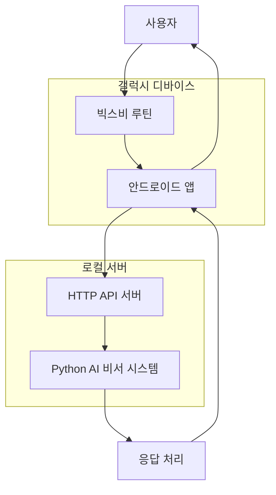

# 설계 문서

## 개요

삼성 갤럭시의 빅스비 루틴과 연동되는 안드로이드 애플리케이션을 개발하여 사용자가 텍스트 또는 음성으로 쿼리를 입력하고, 기존 Python 기반 AI 비서 시스템으로 전달하는 시스템입니다. 빅스비 캡슐, 딥 링크, 안드로이드 앱 액션을 활용하여 자동으로 루틴에 통합됩니다.

## 아키텍처

### 전체 시스템 아키텍처



### 컴포넌트 간 통신 흐름

1. **사용자 → 빅스비 루틴**: 전원버튼 길게 누르기 또는 음성 명령
2. **빅스비 루틴 → 안드로이드 앱**: 딥 링크 또는 앱 액션 실행
3. **안드로이드 앱 → HTTP API**: REST API를 통한 쿼리 전송
4. **HTTP API → Python 시스템**: query.txt 파일 생성 및 main.py 실행
5. **Python 시스템 → HTTP API**: 처리 결과 반환
6. **HTTP API → 안드로이드 앱**: JSON 응답
7. **안드로이드 앱 → 사용자**: 결과 표시

## 컴포넌트 및 인터페이스

### 1. 안드로이드 애플리케이션

#### 1.1 주요 컴포넌트

- **MainActivity**: 메인 화면 및 텍스트 입력 인터페이스
- **VoiceInputActivity**: 음성 입력 처리 화면
- **SettingsActivity**: 서버 연결 설정 화면
- **ApiService**: HTTP API 통신 서비스
- **BixbyIntentHandler**: 빅스비 루틴 연동 처리

#### 1.2 빅스비 통합 컴포넌트

- **Bixby Capsule**: 빅스비에서 앱을 호출하기 위한 캡슐
- **Deep Link Handler**: 딥 링크를 통한 앱 실행 처리
- **App Actions**: 안드로이드 앱 액션 정의

#### 1.3 UI 컴포넌트

- **텍스트 입력 화면**: EditText, 전송 버튼, 상태 표시
- **음성 입력 화면**: 녹음 버튼, 파형 표시, STT 결과
- **설정 화면**: 서버 URL, 포트, 연결 테스트

### 2. HTTP API 서버

#### 2.1 엔드포인트 설계

```
POST /api/query
Content-Type: application/json

Request Body:
{
  "query": "오늘 일정 알려줘",
  "input_type": "text|voice",
  "timestamp": "2025-02-08T10:30:00Z",
  "device_id": "galaxy_s24_001"
}

Response:
{
  "status": "success|error",
  "response": "처리된 응답 텍스트",
  "processing_time": 2.5,
  "agent_type": "general|financial",
  "error_message": null
}
```

#### 2.2 서버 구조

- **Flask/FastAPI 기반 웹 서버**
- **비동기 처리**: 쿼리 처리 중 다른 요청 처리 가능
- **로깅**: 모든 요청/응답 로그 기록
- **에러 핸들링**: 적절한 HTTP 상태 코드 반환

### 3. Python AI 비서 시스템 연동

#### 3.1 기존 시스템과의 통합

- **query.txt 파일 생성**: API 서버에서 받은 쿼리를 파일로 저장
- **main.py 실행**: subprocess를 통한 Python 스크립트 실행
- **결과 파싱**: 표준 출력 또는 결과 파일에서 응답 추출

#### 3.2 프로세스 관리

- **동시 실행 제한**: 한 번에 하나의 쿼리만 처리
- **타임아웃 처리**: 10초 이상 응답이 없으면 타임아웃
- **프로세스 모니터링**: 실행 상태 추적 및 로깅

## 데이터 모델

### 1. 쿼리 요청 모델

```kotlin
data class QueryRequest(
    val query: String,
    val inputType: InputType,
    val timestamp: String,
    val deviceId: String
)

enum class InputType {
    TEXT, VOICE
}
```

### 2. API 응답 모델

```kotlin
data class QueryResponse(
    val status: ResponseStatus,
    val response: String?,
    val processingTime: Double,
    val agentType: String?,
    val errorMessage: String?
)

enum class ResponseStatus {
    SUCCESS, ERROR, TIMEOUT
}
```

### 3. 설정 모델

```kotlin
data class ServerConfig(
    val baseUrl: String,
    val port: Int,
    val timeout: Int,
    val retryCount: Int
)
```

## 에러 핸들링

### 1. 네트워크 에러

- **연결 실패**: 서버 연결 불가 시 재시도 로직
- **타임아웃**: 요청 타임아웃 시 사용자에게 알림
- **HTTP 에러**: 4xx, 5xx 에러 코드별 적절한 메시지 표시

### 2. 음성 인식 에러

- **권한 거부**: 마이크 권한 요청 및 설정 안내
- **인식 실패**: 다시 녹음 또는 텍스트 입력 옵션 제공
- **노이즈**: 조용한 환경에서 다시 시도 안내

### 3. 시스템 에러

- **앱 크래시**: 크래시 로그 수집 및 복구
- **메모리 부족**: 리소스 정리 및 최적화
- **권한 문제**: 필요한 권한 요청 및 설명

## 테스트 전략

### 1. 단위 테스트

- **API 서비스 테스트**: HTTP 통신 로직 검증
- **음성 인식 테스트**: STT 기능 정확성 검증
- **데이터 모델 테스트**: 직렬화/역직렬화 검증

### 2. 통합 테스트

- **빅스비 연동 테스트**: 실제 빅스비 루틴에서 앱 실행 검증
- **API 서버 연동 테스트**: 안드로이드 앱과 서버 간 통신 검증
- **Python 시스템 연동 테스트**: 전체 파이프라인 동작 검증

### 3. UI 테스트

- **사용자 시나리오 테스트**: 실제 사용 흐름 검증
- **접근성 테스트**: 시각/청각 장애인 사용성 검증
- **성능 테스트**: 앱 반응 속도 및 메모리 사용량 측정

## 보안 고려사항

### 1. 데이터 보호

- **HTTPS 통신**: 모든 API 통신은 HTTPS 사용
- **데이터 암호화**: 민감한 데이터는 AES 암호화
- **로컬 저장소 보안**: SharedPreferences 암호화

### 2. 인증 및 권한

- **디바이스 인증**: 디바이스 ID 기반 간단한 인증
- **API 키 관리**: 서버 API 키 안전한 저장
- **권한 최소화**: 필요한 권한만 요청

### 3. 개인정보 보호

- **음성 데이터**: 로컬에서만 처리, 서버 전송 시 즉시 삭제
- **쿼리 로그**: 개인정보 포함 시 마스킹 처리
- **세션 관리**: 앱 종료 시 임시 데이터 삭제

## 성능 최적화

### 1. 앱 성능

- **메모리 관리**: 음성 데이터 및 이미지 리소스 적절한 해제
- **배터리 최적화**: 백그라운드 작업 최소화
- **네트워크 최적화**: 요청 압축 및 캐싱

### 2. 서버 성능

- **비동기 처리**: 여러 요청 동시 처리
- **캐싱**: 자주 사용되는 응답 캐싱
- **로드 밸런싱**: 필요시 다중 서버 구성

### 3. 사용자 경험

- **빠른 응답**: 3초 이내 처리 시작 표시
- **진행 상황 표시**: 처리 중 상태 실시간 업데이트
- **오프라인 모드**: 네트워크 없을 때 기본 안내 메시지